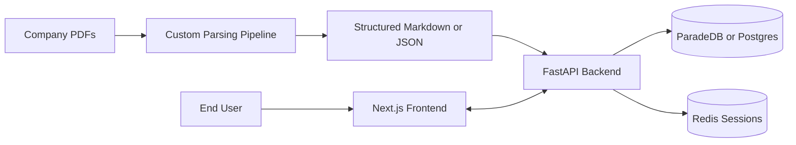

# AIlways
## Meeting Truth and Context Copilot

<p>
  
  
  
  
  
</p>

AIlways helps teams find reliable answers from internal company PDFs, with strong handling for tables that continue across pages.

## Summary

- Problem: enterprise PDFs are hard to search reliably when table structure breaks across pages.
- Build: full-stack internal tool foundation (auth-enabled app + API + custom parser).
- Differentiator: table-aware parsing heuristics for multi-page continuity.
- Evidence: parsed 830 PDFs in ~6.08 seconds on this repository workload.

## Why This Project

| Problem | Approach | Result |
| --- | --- | --- |
| Company docs are hard to query because tables break across pages and lose structure. | Custom PDF parsing pipeline with table-aware post-processing on top of `pdfplumber`. | Faster, cleaner extraction that keeps table continuity and improves downstream retrieval quality. |
| Internal tools need secure access control. | Cookie-based auth flow with CSRF checks and rate limits. | Practical base for production-like internal usage. |

## What Is Built

- `frontend/`: Next.js app with sign up, sign in, and protected dashboard.
- `backend/`: FastAPI service with auth endpoints, sessions in Redis, and ParadeDB/Postgres integration.
- `learnings/parsing/`: Custom CLI parser for text and table extraction from PDFs.

## Architecture



## Parsing Highlights

- Adaptive strategy selection for bordered vs borderless tables.
- Multi-page table continuation detection using column alignment heuristics.
- Automatic header deduplication when the same table header repeats on new pages.
- Right-edge truncation repair for clipped last-column text.
- CLI output in `markdown`, `json`, or `text`.

## Performance Snapshot

Observed on this repository workload:

```bash
INFO     root  Processed 830 file(s).
python -m parsing "../data/CompanyDocuments/PurchaseOrders/" -o output_dir/   5.52s user 0.26s system 95% cpu 6.080 total
```

- Total: ~6.08s for 830 PDFs
- Average: ~0.007s per document

## Key Decisions

<details>
<summary><strong>Dataset Selection</strong></summary>

- Chosen dataset: company documents (2,677 PDFs including invoices, purchase orders, shipping docs, inventory reports).
- Reason: directly matches the target use case of enterprise document search with table-heavy content.
- Rejected options were less relevant (domain mismatch) or already pre-extracted to JSON.

</details>

<details>
<summary><strong>Parsing Stack Selection</strong></summary>

- Final base parser: `pdfplumber` + custom post-processing.
- Why: strong control over extraction flow and enough speed for bulk parsing.
- Alternatives tested: Docling, Unstructured, vLLM + Docling, vision-model API route.
- Outcome: alternatives were slower and/or weaker for multi-page table continuity.

</details>

## Quick Start

Prerequisites: Python 3.12+, Node.js 20+, Docker, and `uv`.

### 1. Backend

```bash
cd backend
cp .env.example .env
docker compose up -d

uv sync
uv run alembic upgrade head
uv run python -m app
```

Backend runs at `http://localhost:8080`  
Health check: `GET http://localhost:8080/health`

### 2. Frontend

```bash
cd frontend
npm install
npm run dev
```

Frontend runs at `http://localhost:3000`

### 3. Run the parser

```bash
cd learnings
python -m parsing "../data/CompanyDocuments/PurchaseOrders/" -o output_dir/
```

## Project Structure

```text
.
├── backend/            # FastAPI, auth, DB, Redis session handling
├── frontend/           # Next.js UI and auth routes
├── learnings/parsing/  # Custom PDF parsing pipeline
├── data/               # Dataset directory
└── README.md
```

## Contributing

Contributions are welcome. Open an issue or submit a pull request for fixes, features, or documentation improvements.

## License

MIT. See `LICENSE`.
