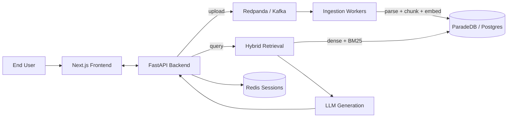

# AIlways
## Meeting Truth and Context Copilot

<p>
  
  
  
  
  
  
  
  
</p>

AIlways helps teams find reliable answers from internal company PDFs — invoices, purchase orders, shipping orders, and inventory reports — with strong handling for tables that continue across pages and a hybrid retrieval pipeline for accurate, cited answers.

## Summary

- Problem: enterprise PDFs are hard to search and query reliably when table structure breaks across pages.
- Build: full-stack RAG platform with event-driven ingestion, hybrid retrieval, and cited answer generation.
- Differentiator: table-aware parsing heuristics for multi-page continuity, combined with dense + BM25 hybrid search.
- Evidence: parsed 830 PDFs in ~6.08 seconds; ingested 300 documents end-to-end in under 15 seconds.

## Why This Project

| Problem | Approach | Result |
| --- | --- | --- |
| Company docs are hard to query because tables break across pages and lose structure. | Custom PDF parsing pipeline with table-aware post-processing on top of `pdfplumber`. | Faster, cleaner extraction that keeps table continuity and improves downstream retrieval quality. |
| Single-retrieval strategies miss relevant documents in structurally similar corpora. | Hybrid search: pgvector dense + ParadeDB BM25 sparse, fused with RRF and diversified with MMR. | Accurate retrieval even across 300+ near-identical purchase order PDFs. |
| Sequential per-document ingestion is too slow at scale. | Event-driven Kafka pipeline with cross-document embedding batching and multiple concurrent consumers. | 300 documents ingested in under 15 seconds vs. ~5 minutes sequentially. |
| Internal tools need secure access control. | Session-based auth with Argon2 hashing, CSRF protection, and role-based vault access. | Practical base for production-like internal usage. |

## What Is Built

- `frontend/`: Next.js app with sign up, sign in, and protected dashboard.
- `backend/`: FastAPI service with a full RAG pipeline (parse → chunk → embed → retrieve → generate), event-driven ingestion workers, session auth via Redis, and ParadeDB/Postgres storage.
- `learnings/parsing/`: Standalone CLI parser for text and table extraction from PDFs.

## Architecture



## RAG Pipeline

The retrieval-augmented generation pipeline runs in two phases:

**Ingestion** (async, event-driven):

1. **Parse** — `pdfplumber`-based extraction with table-aware heuristics outputs structured Markdown.
2. **Chunk** — Recursive character splitting (512 tokens, 50 overlap) with Markdown-aware separators. Each chunk gets a `[Source: filename]` header.
3. **Embed** — OpenAI `text-embedding-3-large` (1536 dims). Chunks from multiple documents are batched into a single API call.
4. **Store** — Bulk insert into Postgres with pgvector embeddings and content hashes.

**Query** (sync, per-request):

1. **Embed query** → dense vector.
2. **Retrieve** — Hybrid search: pgvector cosine similarity + ParadeDB BM25 full-text, fused with Reciprocal Rank Fusion (k=60), then diversified with Maximal Marginal Relevance (λ=0.7).
3. **Generate** — `gpt-4o-mini` (temperature 0.1, JSON mode) with strict grounding: answer only from provided context, return citations with exact quotes, confidence score, and a `has_sufficient_evidence` flag.

## Ingestion Architecture

Ingestion is event-driven and optimised for throughput:

- **Kafka (Redpanda)** — File upload events are published to `file.events`, partitioned by vault ID for ordering.
- **Batch accumulation** — Each consumer collects up to 20 messages or waits 2 seconds, whichever comes first.
- **Cross-document embedding** — All chunks from a batch are embedded in a single OpenAI API call instead of one call per document.
- **Multi-consumer concurrency** — Multiple ingestion workers in the same consumer group, each processing batches in parallel. Partition count auto-scales to match.
- **Failure isolation** — Savepoints isolate per-document failures so one bad document doesn't roll back the batch.
- **Graceful degradation** — If Kafka is unavailable at startup, the API falls back to synchronous ingestion.
- **Dead letter queue** — Failed events route to `ingestion.dlq` for inspection.
- **Recovery** — Documents stuck in `pending`/`ingesting` for more than 5 minutes are automatically re-queued.

## Parsing Highlights

- Adaptive strategy selection for bordered vs borderless tables.
- Multi-page table continuation detection using column alignment heuristics.
- Automatic header deduplication when the same table header repeats on new pages.
- Right-edge truncation repair for clipped last-column text.
- CLI output in `markdown`, `json`, or `text`.

## Performance Snapshot

**Parsing** (standalone CLI, 830 PDFs):

```bash
INFO     root  Processed 830 file(s).
python -m parsing "../data/CompanyDocuments/PurchaseOrders/" -o output_dir/   5.52s user 0.26s system 95% cpu 6.080 total
```

- Total: ~6.08s for 830 PDFs (~0.007s per document)

**Ingestion** (end-to-end via Kafka workers, 300 PDFs):

- Upload: 300 files in ~9 seconds
- Parse + chunk + embed + store: all 300 active before the first status poll (~15 seconds total)

## Key Decisions

<details>
<summary><strong>Dataset Selection</strong></summary>

- Chosen dataset: company documents (2,677 PDFs including invoices, purchase orders, shipping docs, inventory reports).
- Reason: directly matches the target use case of enterprise document search with table-heavy content.
- Rejected options were less relevant (domain mismatch) or already pre-extracted to JSON.

</details>

<details>
<summary><strong>Parsing Stack Selection</strong></summary>

- Final base parser: `pdfplumber` + custom post-processing.
- Why: strong control over extraction flow and enough speed for bulk parsing.
- Alternatives tested: Docling, Unstructured, vLLM + Docling, vision-model API route.
- Outcome: alternatives were slower and/or weaker for multi-page table continuity.

</details>

<details>
<summary><strong>Kafka / Event-Driven Ingestion</strong></summary>

- Chose Redpanda (Kafka-compatible) over direct synchronous ingestion.
- Why: decouples upload latency from processing time, enables horizontal scaling with multiple consumers, and allows batch accumulation for cross-document embedding (single API call for N documents).
- Alternatives considered: Celery + Redis (simpler but no native partitioning or consumer groups), synchronous inline processing (blocks the upload request), SQS/cloud queues (adds cloud vendor lock-in).
- Outcome: 300 documents ingested in ~15 seconds with 5 concurrent consumers. Synchronous fallback preserved for single-node deployments where Kafka is unavailable.

</details>

<details>
<summary><strong>Retrieval Strategy</strong></summary>

- Hybrid search: pgvector dense + ParadeDB BM25 sparse, fused with Reciprocal Rank Fusion, diversified with MMR.
- Why: dense search alone fails on corpora with structurally identical documents (e.g., 300 purchase orders with near-identical embeddings). BM25 excels at exact ID/keyword matching. RRF merges both ranked lists without needing score normalisation. MMR prevents redundant results.
- Rejected: dense-only (misses keyword-specific queries), BM25-only (misses semantic similarity), `langchain-postgres` (requires psycopg3, incompatible with asyncpg; no BM25 support).

</details>

## Quick Start

Prerequisites: Python 3.12+, Node.js 20+, Docker, and `uv`.

### 1. Backend

```bash
cd backend
cp .env.example .env
docker compose up -d

uv sync
uv run alembic upgrade head
uv run python -m app
```

Backend runs at `http://localhost:8080`  
Health check: `GET http://localhost:8080/health`

### 2. Workers

```bash
cd backend
uv run python -m app.workers.runner --worker all
```

Starts ingestion, deletion, and audit workers with batch processing enabled.

### 3. Frontend

```bash
cd frontend
npm install
npm run dev
```

Frontend runs at `http://localhost:3000`

### 4. Standalone parser

```bash
cd learnings
python -m parsing "../data/CompanyDocuments/PurchaseOrders/" -o output_dir/
```

## Project Structure

```text
.
├── backend/
│   ├── app/
│   │   ├── api/            # Routes: auth, vaults, documents, query
│   │   ├── core/
│   │   │   ├── kafka/      # Producer, consumer, DLQ, events
│   │   │   └── rag/        # Parsing, chunking, embedding, retrieval, generation
│   │   ├── db/             # Models, sessions, file storage
│   │   └── workers/        # Ingestion, deletion, audit workers + runner
│   └── tests/
├── frontend/               # Next.js UI and auth routes
├── learnings/parsing/      # Standalone PDF parsing CLI
├── data/                   # Dataset directory (2,677 PDFs)
└── README.md
```

## Contributing

Contributions are welcome. Open an issue or submit a pull request for fixes, features, or documentation improvements.

## License

MIT. See `LICENSE`.
