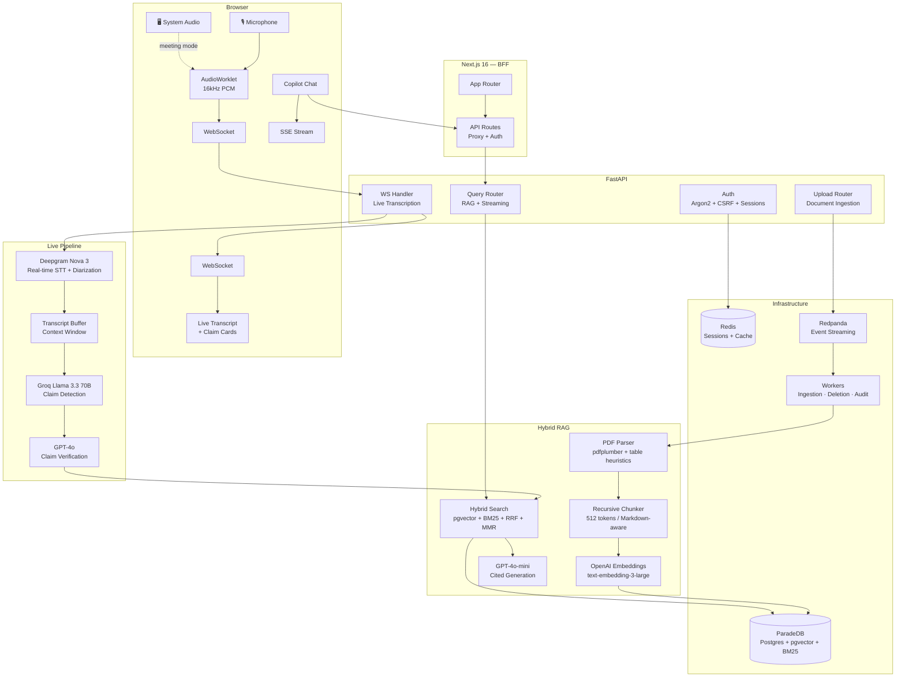

<div align="center">

# AIlways

### Meeting Truth & Context Copilot

**Real-time live transcription** with **instant fact-checking** against your company documents — while the meeting is still happening.

<p>
  
  
  
  
  
  
  
  
</p>

[Features](#-what-it-does) · [Architecture](#-architecture) · [Live Demo Flow](#-live-demo-flow) · [Quick Start](#-quick-start) · [Deep Dives](#-deep-dives)

</div>

---

## Video

[](https://www.youtube.com/watch?v=R7A8SB_S_Z4)

---

## The Problem

Someone in a meeting says *"Invoice 10332 totals \$4,500"* — but the actual invoice says **$3,850**. Nobody catches it. The decision moves forward on bad data.

Enterprise teams make critical decisions referencing documents they can't search fast enough — invoices, purchase orders, shipping records, inventory reports. Tables break across PDF pages, exact IDs get buried in near-identical documents, and nobody fact-checks claims in real time.

**AIlways changes that.** It listens to your meeting, identifies factual claims as they're spoken, and verifies them against your documents — live, with citations.

---

## ✦ What It Does

### 🎙️ Live Transcription + Real-Time Fact-Checking

| What happens | How |
|---|---|
| You speak into your mic (or capture an entire meeting) | Browser AudioWorklet captures 16kHz PCM, streamed over WebSocket |
| Words appear in real time with speaker diarization | Deepgram Nova 3 with per-channel speaker identification |
| Factual claims are extracted as you speak | Groq Llama 3.3 70B detects verifiable assertions in ~200ms |
| Each claim is instantly verified against your documents | Hybrid RAG retrieval + GPT-4o verdict with cited evidence |
| You see ✅ Supported, ❌ Contradicted, or ⚠️ Unverifiable — live | Verdict + confidence + exact quotes from source documents |

**Two audio modes:**
- **Mic Only** — captures your microphone for dictation, interviews, or solo note-taking.
- **Meeting Mode** — captures mic + system audio via screen share, with multichannel processing so your voice and remote participants are separated and diarized independently. (Currently only 2 speakers supported — local user on channel 0, all remote speakers merged on channel 1.)

### 💬 RAG Copilot

A multi-turn chat interface that queries your document vault with streaming answers, inline citations with exact quotes, and a confidence panel showing evidence sufficiency, chunk count, and latency.

### 📂 Document Vaults

Organize documents into vaults with role-based access (owner / editor / viewer). Upload PDFs, TXT, or Markdown. Documents are parsed, chunked, embedded, and indexed automatically through an event-driven pipeline — 300 documents ingested in under 15 seconds.

### 📋 Session History

Every transcription session is persisted with full transcript, speaker attribution, and all detected claims with their verdicts. Review past sessions, rename them, search across history.

---

## ⚡ Architecture



---

## 🎬 Live Demo Flow

Here's what happens in a typical session, end to end:

```
1. User signs in → session cookie + CSRF token set
2. User opens Transcription → selects a vault → clicks "Start Recording"
3. Frontend requests one-time WS ticket (POST /auth/ws-ticket)
4. AudioContext created at 16kHz → AudioWorklet loaded
5. Mic access granted → PCM frames buffered at ~256ms chunks
6. WebSocket opened: ws://backend/vaults/{id}/transcribe/live?ticket=...&channels=1
7. Backend authenticates ticket (atomic Redis consume) → creates DB session
8. Backend opens Deepgram Nova 3 live WebSocket (encoding=linear16, diarize=true)
9. Audio chunks forwarded: Browser → Backend WS → Deepgram WS

    ┌─ Every ~0.5s: Deepgram returns transcript segments
    │   → Buffered in TranscriptBuffer
    │   → Persisted to DB (batched every 2s)
    │   → Sent to client as { type: "transcript", speaker, text, ... }
    │
    ├─ Every 1s: Flush timer checks should_trigger_claims()
    │   → If speaker idle ≥ 2s OR batch interval ≥ 6s with enough content:
    │       → Groq Llama 3.3 70B extracts claims (~200ms)
    │       → Deduplicated via word-overlap fingerprinting
    │       → Sent to client: { type: "claim_detected", ... }
    │       → Hybrid search retrieves relevant chunks
    │       → GPT-4o verifies: supported / contradicted / unverifiable
    │       → Sent to client: { type: "claim_verified", verdict, evidence, ... }
    │
    └─ Every 30s: Heartbeat ping keeps connection alive

10. User clicks Stop → "stop" message sent → Deepgram finalize → drain remaining segments
11. Session finalized in DB with aggregate stats (duration, speakers, segments, claims)
12. User can review session anytime from Sessions page
```

---

## 🔍 Deep Dives

<details>
<summary><b>🎙️ Real-Time Transcription Engine</b></summary>

### Browser Audio Pipeline

The frontend captures audio through the Web Audio API's `AudioWorkletNode`, running on the audio rendering thread for zero-skip processing:

- **Mic-only mode:** Mono PCM at 16kHz with explicit `channelCount: 1` to prevent browser upmixing.
- **Meeting mode:** System audio captured via `getDisplayMedia`, merged with mic audio through a `ChannelMerger` node into stereo. Channel 0 = mic (local), Channel 1 = system (remote participants).
- **Buffering:** The worklet accumulates 4,096 frames (~256ms) before posting to the main thread, reducing WebSocket message rate from ~125/s to ~4/s.
- **Encoding:** Float32 → Int16 PCM conversion in the main thread before sending over WebSocket.
- **AudioContext guard:** Explicit `resume()` call handles Chrome's autoplay policy when the user gesture context has expired after async operations.

### Deepgram Integration

- **Model:** Nova 3 with real-time speaker diarization.
- **Multichannel processing:** In meeting mode, `multichannel=true` tells Deepgram to process each channel independently — the local speaker is always identified correctly on channel 0, while remote speakers are diarized on channel 1.
- **Speaker remapping:** Channel 0 → always Speaker 0 (local user). Channel 1 → Speaker N+1 (avoids ID collision with local speaker).
- **Endpointing:** 500ms silence threshold for utterance boundaries.

### Backend Concurrency Model

Five concurrent async tasks run per WebSocket session:

| Task | Purpose |
|---|---|
| **Main loop** | Forwards browser audio → Deepgram |
| **Receiver loop** | Deepgram → buffer → persist → send to client |
| **Flush timer** | Triggers claim detection every 1s |
| **DB flush** | Batch-writes segments to Postgres every 2s |
| **Heartbeat** | WS keep-alive pings every 30s |

All tasks coordinate through an `asyncio.Event` for clean shutdown.

</details>

<details>
<summary><b>🧠 Claim Detection & Verification Pipeline</b></summary>

### Detection (Groq Llama 3.3 70B)

Claims are extracted from speech segments using a carefully engineered prompt that:
- Identifies verifiable factual assertions AND data lookup requests.
- Produces self-contained claims with full entity references (no dangling pronouns).
- Normalizes numbers (removes thousand separators that Deepgram's `smart_format` inserts).
- Skips opinions, greetings, hypotheticals, and questions.
- Uses a sliding context window (last 10 checked segments) for co-reference resolution.
- Tracks entities (invoice numbers, order IDs, amounts) via regex extraction for better claim context.

**Performance:** ~200ms per batch via Groq's optimized inference. Exponential backoff with 3 retries.

### Deduplication

Word-overlap Jaccard fingerprinting with a 0.8 threshold prevents the same claim from being verified twice, even when phrased slightly differently across utterances.

### Verification (GPT-4o + Hybrid RAG)

Each detected claim goes through a multi-stage verification:

1. **Enrich** — Combine claim text + conversation context + tracked entity IDs into a search query.
2. **Exact-ID pre-filter** — Direct SQL `ILIKE` lookup for entity identifiers. Critical for corpora with 800+ structurally identical documents where dense embeddings fail to distinguish individual invoices.
3. **Hybrid search** — Dense (pgvector cosine) + Sparse (ParadeDB BM25) fused with RRF (k=60), MMR at λ=1.0 (pure relevance, no diversity penalty — we want the most relevant evidence, not variety).
4. **Merge & deduplicate** — Exact-ID results combined with hybrid results, duplicates removed.
5. **LLM verification** — GPT-4o receives the claim + retrieved evidence and produces:
   - **Verdict:** `supported` / `contradicted` / `unverifiable`
   - **Confidence score** (0.0–1.0)
   - **Explanation** — why the verdict was reached
   - **Evidence** — exact quotes with document title, section, and page number

**Max 5 concurrent verification tasks** per session, controlled by semaphore.

</details>

<details>
<summary><b>📄 RAG Pipeline — Ingestion & Retrieval</b></summary>

### Ingestion

**Event-driven architecture** with Kafka (Redpanda) for throughput and resilience:

```
Upload → SHA-256 dedup (advisory lock) → Kafka → Worker batch (up to 20 docs)
  → Parse (pdfplumber, process pool) → Chunk (512 tok, Markdown-aware)
    → Embed ALL chunks in one API call → Bulk insert to Postgres
```

Key design choices:
- **Cross-document embedding batching** — Chunks from N documents in a batch are concatenated into a single OpenAI API call (up to 2,048 texts). This is the single biggest throughput optimization.
- **Savepoint isolation** — Each document in a batch gets a SQL savepoint. One corrupt PDF doesn't roll back the entire batch.
- **Graceful degradation** — If Kafka is unavailable, uploads fall back to synchronous ingestion.
- **Dead letter queue** — Failed events route to `ingestion.dlq` with retry metadata.
- **Stuck document recovery** — The worker runner periodically re-queues documents stuck in `pending`/`ingesting` for more than 5 minutes.

### PDF Parsing

Custom `pdfplumber` pipeline with table-aware heuristics:
- Adaptive strategy for bordered vs borderless tables.
- **Multi-page table continuation** — Column alignment heuristics detect when a table spans pages.
- **Header deduplication** — Removes repeated headers when a table continues on a new page.
- **Right-edge truncation repair** — Fixes clipped last-column text.
- **Process pool execution** — 2 workers bypass the GIL for concurrent PDF processing.
- Outputs clean Markdown suitable for chunking and retrieval.

### Chunking

`RecursiveCharacterTextSplitter` with `tiktoken` (`cl100k_base`):
- 512 tokens per chunk, 50 token overlap.
- Markdown-aware separators: H2 → H3 → paragraph → line → sentence → word.
- Source header prepended: `[Source: invoice_10332]` — boosts BM25 relevance for ID-specific queries.

### Retrieval

**Hybrid search** combining two complementary strategies:

| Stage | Method | Why |
|---|---|---|
| Dense | pgvector cosine similarity | Semantic understanding — "show me shipping costs" matches "freight charges" |
| Sparse | ParadeDB BM25 full-text | Exact matching — "invoice 10332" finds the exact document |
| Fusion | Reciprocal Rank Fusion (k=60) | Merges ranked lists without score normalization |
| Diversity | Maximal Marginal Relevance (λ=0.7) | Prevents redundant chunks from dominating results |

**Fetch strategy:** `fetch_k = max(top_k × 6, 40)` candidates, then MMR selects the final `top_k`.

### Generation

- **Model:** GPT-4o-mini (temperature 0.1, JSON mode).
- **Strict grounding:** Answer only from provided context. If evidence is insufficient, say so.
- **Output structure:** Answer text, citations (doc title, section, page, exact quote), confidence score, `has_sufficient_evidence` flag.
- **Streaming:** Server-Sent Events with token deltas → final structured `done` event.
- **Embedding cache:** Redis-backed query dedup (5-minute TTL) eliminates redundant OpenAI calls.

</details>

<details>
<summary><b>🔐 Auth & Security</b></summary>

- **Password hashing:** Argon2id via `pwdlib` (memory-hard, GPU-resistant).
- **Session management:** Redis-backed sessions with 7-day TTL. `session_id` cookie (httpOnly, no JS access).
- **CSRF protection:** Double-submit cookie pattern. `csrf_token` cookie (JS-readable) + `X-CSRF-Token` header on all mutating requests.
- **WebSocket auth:** One-time ticket system — short-lived (60s), consumed atomically via Redis pipeline on first use. No long-lived tokens in query params.
- **Role-based access:** Three-tier vault permissions (owner > editor > viewer) enforced at the router level.
- **Rate limiting:** Registration and login endpoints rate-limited at 5 requests/minute.
- **Frontend middleware:** Cookie-based route protection with server-side `getMe()` validation.

</details>

<details>
<summary><b>⚙️ Event-Driven Workers</b></summary>

Three Kafka consumer workers, all extending a common `BaseWorker`:

| Worker | Topic | Mode | When |
|---|---|---|---|
| **Ingestion** | `file.events` (`file.uploaded`) | Batch (up to 20) | Document uploaded |
| **Deletion** | `file.events` (`file.deleted`) | Single event | Document deleted |
| **Audit** | `audit.events` | Single event | Any auditable action |

**Runner CLI:**
```bash
python -m app.workers.runner --worker all          # Start all workers
python -m app.workers.runner --worker ingestion     # Start specific worker
```

The runner also handles:
- Stuck document recovery (re-queue after configurable timeout).
- Kafka topic partition auto-scaling.
- Graceful shutdown on SIGINT/SIGTERM.

</details>

<details>
<summary><b>🏗️ Engineering Decisions</b></summary>

### Why Hybrid Search (Not Dense-Only)?

Dense embeddings fail catastrophically on structurally identical documents. When 300 purchase orders share the same template and similar amounts, their embeddings converge. Asking "What's the total for PO 10261?" returns chunks from the wrong PO. BM25 solves this — exact keyword matching finds "PO 10261" reliably. RRF merges both without needing score normalization.

### Why Kafka (Not Celery)?

Native partitioning by vault ID guarantees ordering. Consumer groups enable horizontal scaling. Batch accumulation enables the cross-document embedding optimization (single API call for N documents). Dead letter queues are a first-class primitive. Synchronous fallback preserved for single-node deployments.

### Why ParadeDB (Not Plain Postgres)?

ParadeDB adds native BM25 full-text search (`pg_search`) alongside pgvector — both in-process, no external Elasticsearch needed. Single database for vectors, full-text, and relational data.

### Why Groq for Claim Detection (Not OpenAI)?

Claim detection runs on every speech pause. At ~200ms per batch, Groq's Llama 3.3 70B is fast enough to feel real-time. GPT-4o would add 1–3 seconds per claim batch — noticeable during a live conversation.

### Why Protocol-Based Architecture?

Parsers, chunkers, embedders, transcribers, claim detectors, and verifiers all use Python `Protocol` classes. Swap Deepgram for Whisper, or Groq for a local model — no inheritance chains, just implement the interface.

</details>

---

## 🛠 Tech Stack

<table>
<tr><td><b>Layer</b></td><td><b>Technology</b></td><td><b>Purpose</b></td></tr>
<tr><td rowspan="3"><b>Frontend</b></td><td>Next.js 16 + React 19</td><td>App Router, SSR, BFF proxy</td></tr>
<tr><td>Tailwind CSS v4</td><td>Styling + responsive design</td></tr>
<tr><td>SWR + SSE</td><td>Data fetching + real-time streaming</td></tr>
<tr><td rowspan="5"><b>Backend</b></td><td>FastAPI + Uvicorn</td><td>Async API + WebSocket server</td></tr>
<tr><td>SQLModel + Alembic</td><td>Async ORM + migrations</td></tr>
<tr><td>Deepgram SDK v6</td><td>Nova 3 real-time STT + diarization</td></tr>
<tr><td>LangChain + OpenAI</td><td>Embeddings + generation</td></tr>
<tr><td>Groq</td><td>Fast claim detection (Llama 3.3 70B)</td></tr>
<tr><td rowspan="3"><b>Infrastructure</b></td><td>ParadeDB (Postgres + pgvector + BM25)</td><td>Vector + full-text + relational DB</td></tr>
<tr><td>Redis 7</td><td>Sessions, CSRF tokens, embedding cache</td></tr>
<tr><td>Redpanda (Kafka-compatible)</td><td>Event streaming + worker orchestration</td></tr>
</table>

---

## 📐 Project Structure

```text
.
├── frontend/                      # Next.js 16 — UI + BFF
│   ├── app/
│   │   ├── (auth)/                # Sign in / Sign up
│   │   ├── (app)/                 # Protected: dashboard, copilot, transcription,
│   │   │                          #   vaults, sessions, history, settings
│   │   └── api/                   # BFF proxy routes → backend
│   ├── components/                # UI components per feature
│   ├── hooks/                     # useTranscription, useConversations
│   └── lib/                       # API client, types, auth, utilities
│
├── backend/                       # FastAPI — API + Workers
│   ├── app/
│   │   ├── api/routers/           # auth, vault, documents, query, transcription, sessions
│   │   ├── core/
│   │   │   ├── rag/               # parsing, chunking, embedding, retrieval, generation
│   │   │   ├── claims/            # detector (Groq), verifier (GPT-4o + RAG)
│   │   │   ├── transcription/     # Deepgram, buffer, persistence
│   │   │   ├── kafka/             # producer, consumer, DLQ, topics
│   │   │   ├── auth/              # session auth, CSRF, WS tickets
│   │   │   └── storage/           # file storage abstraction
│   │   ├── db/models/             # 10 SQLModel tables
│   │   └── workers/               # ingestion, deletion, audit + runner
│   └── tests/
│
├── data/                          # 2,677 enterprise PDFs
│   └── CompanyDocuments/          # Invoices, POs, shipping, inventory
│
└── learnings/parsing/             # Standalone PDF parsing CLI
```

---

## 🚀 Quick Start

**Prerequisites:** Python 3.12+, Node.js 20+, Docker

### 1. Infrastructure

```bash
cd backend
cp .env.example .env          # Add your API keys: DEEPGRAM, OPENAI, GROQ
docker compose up -d           # ParadeDB, Redis, Redpanda
```

### 2. Backend

```bash
cd backend
uv sync
uv run alembic upgrade head
uv run python -m app           # http://localhost:8080
```

### 3. Workers

```bash
cd backend
uv run python -m app.workers.runner --worker all
```

### 4. Frontend

```bash
cd frontend
npm install
npm run dev                     # http://localhost:3000
```

### 5. Try It

1. Sign up at `localhost:3000` → create a vault → upload some PDFs.
2. Open **Copilot** → select your vault → ask questions about your documents.
3. Open **Transcription** → select your vault → click **Start Recording** → speak a factual claim referencing your documents → watch it get verified in real time.

---

## 📊 Performance

| Metric | Result |
|---|---|
| PDF parsing | 830 documents in 6.08s (~7ms/doc) |
| End-to-end ingestion | 300 documents in ~15s (via Kafka batch workers) |
| Claim detection latency | ~200ms per batch (Groq Llama 3.3 70B) |
| Transcription latency | Real-time (Deepgram Nova 3 streaming) |
| Query response | Streaming SSE, first token in <1s |

---

## 🧩 Database Schema

10 tables, all managed through SQLModel + Alembic migrations:

```
users ─┬─► vaults ───► documents ───► chunks (pgvector 1536d)
       │       │
       │       └─► vault_members (role-based access)
       │
       └─► transcription_sessions ─┬─► transcription_segments
                                   └─► transcription_claims

audit_log    (event sourcing)
feedback     (user ratings)
```

---

## 📝 Configuration

All settings live in a single Pydantic Settings class with nested sub-configs, loaded from `.env`:

```python
Settings                         # 50+ root settings
├── ClaimConfig                  # 16 settings: detection, batching, dedup, concurrency
├── TranscriptionConfig          # 8 settings: session timeouts, DB flush, audio limits
└── WorkerConfig                 # 3 settings: batch size, timeout, concurrency
```

Every parameter has a sensible default. Override via environment variables.

---

## License

MIT — see [LICENSE](LICENSE).
