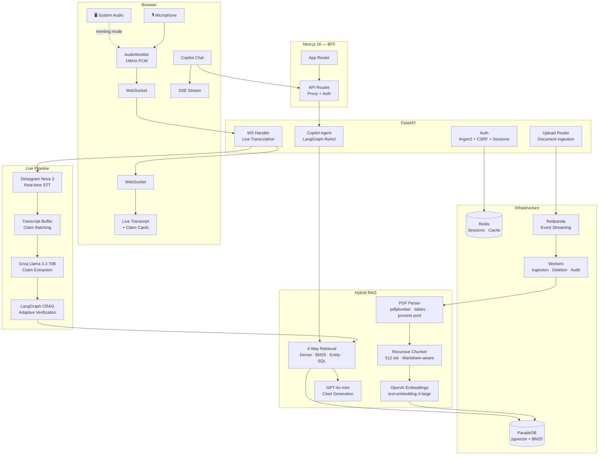

<div align="center">

# AIlways

### Meeting Truth & Context Copilot

**Real-time live transcription** with **instant fact-checking** against your company documents — while the meeting is still happening.

<p>
  
  
  
  
  
  
  
  
  
</p>

[Features](#-features) · [Architecture](#-system-architecture) · [Deep Dives](#-deep-dives) · [Quick Start](#-quick-start) · [Engineering Decisions](#-engineering-decisions)

</div>

---

<div align="center">

[](https://www.youtube.com/watch?v=R7A8SB_S_Z4)

*Click to watch the full demo*

</div>

---

## The Problem

Someone in a meeting says *"Invoice 10332 totals \$4,500"* — but the actual invoice says **$3,850**. Nobody catches it. The decision moves forward on bad data.

Enterprise teams make critical decisions referencing documents they can't search fast enough — invoices, purchase orders, shipping records, inventory reports. Tables break across PDF pages, exact IDs get buried in 800+ near-identical documents, and nobody fact-checks claims in real time.

**AIlways changes that.** It listens to your meeting, identifies factual claims as they're spoken, and verifies them against your documents — live, with cited evidence.

---

## ✦ Features

### 🎙️ Live Transcription + Real-Time Fact-Checking

| What happens | How |
|---|---|
| You speak into your mic (or capture an entire meeting) | Browser AudioWorklet captures 16kHz PCM, streamed over WebSocket |
| Words appear in real time with speaker diarization | Deepgram Nova 3 with per-channel speaker identification |
| Factual claims are extracted as you speak | Groq Llama 3.3 70B detects verifiable assertions in ~200ms |
| Each claim is verified via an **Adaptive Corrective-RAG** pipeline | LangGraph state machine with smart query routing |
| You see ✅ Supported, ❌ Contradicted, or ⚠️ Unverifiable — live | Verdict + confidence + exact quotes from source documents |

**Two audio modes:**
- **Mic Only** — captures your microphone for dictation, interviews, or solo note-taking.
- **Meeting Mode** — captures mic + system audio via screen share, with multichannel processing so your voice and remote participants are separated and diarized independently.

### 💬 Agentic RAG Copilot

A multi-turn chat interface powered by a **LangGraph ReAct agent** with 5 specialized tools. The agent decides how to answer each query — a question like *"how many invoices from July 2016?"* routes to an **SQL fast-path** (~83ms, zero LLM), while *"what's the total on invoice 10332?"* triggers an **entity-boosted hybrid search**. Streaming answers with inline citations, confidence scoring, and evidence sufficiency panel.

### 📂 Document Vaults

Organize documents into vaults with role-based access (owner / editor / viewer). Upload PDFs, TXT, or Markdown. Documents are parsed, chunked, embedded, and indexed automatically through an event-driven pipeline — **300 documents ingested in under 15 seconds**.

### 📋 Session History

Every transcription session is persisted with full transcript, speaker attribution, and all detected claims with their verdicts. Review past sessions, rename them, search across history.

---

## 📊 Performance

| Metric | Result | How |
|---|---|---|
| PDF parsing (pdfplumber) | **830 docs in 6s** (~7ms/doc) | Process pool, zero LLM |
| End-to-end ingestion | **300 docs in ~15s** | Kafka batch workers + single embedding API call |
| Aggregate queries | **~83ms** | SQL fast-path — regex classify → ORM query → deterministic verdict, no LLM |
| Claim detection | **~200ms** per batch | Groq Llama 3.3 70B |
| Point queries (RAG) | **1–3s** | Hybrid search + LLM grading + LLM synthesis |
| Transcription | **Real-time** | Deepgram Nova 3 streaming WebSocket |
| Copilot first token | **<1s** | Streaming SSE |

---

## ⚡ System Architecture



### How a Query is Answered — Two Paths

The system uses **rule-based regex classification** (zero LLM cost, sub-millisecond) to route every query to the optimal path:

```
User query
    │
    ├─ rewrite_query() ── coreference resolution via gpt-4o-mini
    │
    ├─ classify_query_type() ── regex: 13 aggregate patterns + 2-tier point override
    │
    ▼
┌────────────────┐                    ┌────────────────┐
│  AGGREGATE     │                    │  POINT         │
│  "how many     │                    │  "what's the   │
│   invoices?"   │                    │   total on     │
│                │                    │   invoice 10332"│
├────────────────┤                    ├────────────────┤
│ parse filters  │                    │ extract entity │
│ (regex: type,  │                    │ IDs (regex)    │
│  date, cust.)  │                    │                │
│       ↓        │                    │       ↓        │
│ SQL ORM query  │                    │ entity_search  │
│ COUNT/SUM/LIST │                    │ + hybrid_search│
│       ↓        │                    │ (dense + BM25) │
│ deterministic  │                    │       ↓        │
│ verdict        │                    │ RRF + MMR      │
│ confidence:1.0 │                    │       ↓        │
│       ↓        │                    │ LLM grading    │
│ ~83 ms         │                    │       ↓        │
│ zero LLM calls │                    │ LLM synthesis  │
│                │                    │       ↓        │
│                │                    │ 1-3 seconds    │
└────────────────┘                    └────────────────┘
```

---

## 🔍 Deep Dives

<details>
<summary><b>🎙️ Real-Time Transcription Engine</b></summary>

### Browser Audio Pipeline

The frontend captures audio through the Web Audio API's `AudioWorkletNode`, running on the audio rendering thread for zero-skip processing:

- **Mic-only mode:** Mono PCM at 16kHz with explicit `channelCount: 1, channelCountMode: "explicit"` to prevent browser upmixing mono to stereo (which would send garbled interleaved data to Deepgram).
- **Meeting mode:** System audio captured via `getDisplayMedia`, merged with mic audio through a `ChannelMerger` node into stereo. Channel 0 = mic (local user), Channel 1 = system (remote participants). Video track is immediately discarded.
- **Buffering:** The worklet accumulates 4,096 frames (~256ms) before posting to the main thread, reducing WebSocket message rate from ~125/s to ~4/s.
- **Encoding:** Float32 → Int16 PCM conversion (`s < 0 ? s * 0x8000 : s * 0x7FFF`) in the main thread before sending over WebSocket.
- **AudioContext guard:** Explicit `resume()` call handles Chrome's autoplay policy when the user gesture context has expired after async operations.

### Deepgram Integration

- **Model:** Nova 3 with real-time streaming + speaker diarization.
- **Multichannel processing:** In meeting mode, `multichannel=true` tells Deepgram to process each channel independently — the local speaker is always identified correctly on channel 0.
- **Speaker remapping:** Channel 0 → always Speaker 0 (local user). Channel 1 → Speaker N+1 (avoids ID collision).
- **Endpointing:** 500ms silence threshold for utterance boundaries.
- **Interim results:** Sent to the client for immediate visual feedback; replaced when final results arrive.

### Backend Concurrency Model

Five concurrent async tasks run per WebSocket session, coordinated via `asyncio.Event`:

| Task | Purpose | Interval |
|---|---|---|
| **Audio sender** | Forwards browser PCM → Deepgram | Continuous |
| **Receiver loop** | Deepgram → buffer → client | ~500ms |
| **Flush timer** | Triggers claim extraction | 1s |
| **DB flush** | Batch-writes segments to Postgres | 2s |
| **Heartbeat** | WebSocket keep-alive ping | 30s |

### WebSocket Auth

One-time ticket system: client requests a ticket (`POST /auth/ws-ticket`), which is stored in Redis with a 60s TTL. On WebSocket connect, the ticket is atomically consumed (get + delete via Redis pipeline) — prevents replay attacks. No long-lived tokens in query params.

</details>

<details>
<summary><b>🧠 Claim Detection & Adaptive Corrective-RAG Verification</b></summary>

### Detection — Groq Llama 3.3 70B

Claims are extracted from speech segments using a prompt that:
- Identifies 5 statement types: point lookups, aggregate queries, factual assertions, category/inventory queries, and comparisons.
- Produces self-contained claims with full entity references (no dangling pronouns).
- Normalizes numbers (removes thousand separators that Deepgram's `smart_format` inserts).
- Skips opinions, greetings, hypotheticals, and questions.
- Uses a sliding context window (last 10 checked segments) for co-reference resolution.
- Preserves short segments containing entity anchors (numeric IDs, currency amounts) even below the min-word threshold.

**Performance:** ~200ms per batch via Groq's optimized inference. Exponential backoff with 3 retries.

### Boosted Jaccard Deduplication

Standard Jaccard would flag *"invoices from July 2016"* and *"invoices from August 2016"* as duplicates (~80% overlap). The system applies **discriminator boosting** — semantically important tokens (months, numbers ≥3 digits, entity IDs, uncommon words) are replicated 3× in the word bag. This drops the overlap to ~50%, well below the 0.8 dedup threshold.

### Verification — LangGraph Adaptive Corrective-RAG

Each claim is verified through a **LangGraph state machine** that adapts its strategy based on query type:

```
START → classify (regex, 0ms)
    │
    ├─ AGGREGATE ──→ SQL fast-path
    │                  ├─ success (1.0 confidence) → END
    │                  └─ metadata gaps → fallback retrieval → synthesise → END
    │
    └─ POINT ──→ entity-boosted hybrid search
                   → LLM relevance grading
                   ├─ relevant → synthesise verdict → END
                   └─ not relevant → transform query → retry (up to N) → synthesise → END
```

**Point path** (Corrective-RAG loop):
1. **Retrieve** — Entity-ID boosted hybrid search (exact SQL `ILIKE` + dense + BM25 with RRF + MMR at λ=1.0 for pure relevance).
2. **Grade** — LLM checks if retrieved evidence is actually relevant (JSON: `{"relevant": true/false}`).
3. **Transform & retry** — If evidence is irrelevant, an LLM rewrites the query and retrieval runs again.
4. **Synthesise** — LLM produces verdict: `supported` / `contradicted` / `unverifiable` with confidence, explanation, and exact quotes.

**Aggregate fast-path** (zero LLM):
1. **Parse** — Regex extracts intent (count/sum/average/list), document type, date range, customer ID.
2. **Validate** — Checks for metadata gaps (e.g., missing `total_price` prevents sum).
3. **Query** — ORM `COUNT`/`SUM` on the `Document` table (indexed columns).
4. **Return** — Deterministic verdict with confidence 1.0. ~83ms end-to-end.

**Caching:** Redis-backed verdict cache keyed on `vault_id + vault.updated_at + SHA256(statement)`. Cache is automatically invalidated when any document in the vault changes.

</details>

<details>
<summary><b>🤖 Agentic RAG Copilot — LangGraph ReAct Agent</b></summary>

### Architecture

The copilot is a **LangGraph ReAct agent** — an LLM that reasons about which tools to call, observes the results, and decides whether to call more tools or produce a final answer. The agent has access to 5 tools:

| Tool | Used for | Retrieval method |
|---|---|---|
| `search_documents` | Semantic questions | Hybrid search (dense + BM25 + RRF + MMR) |
| `lookup_entity` | Entity-specific queries | Direct SQL `ILIKE` on chunk content |
| `filter_documents` | Aggregate / enumeration queries | ORM-based structured filtering (type, date, customer) |
| `get_full_document` | Detailed document analysis | All chunks concatenated (up to 30K chars) |
| `compute` | Math over tool results | Safe Python `eval` (restricted builtins) |

### Smart Query Routing

Before the agent runs, the query is classified via **zero-cost regex** and a planning hint is injected into the system prompt:

- **Aggregate** → *"Use `filter_documents`, NOT `search_documents`"*
- **Compute** → *"Use `filter_documents` then `compute`"*
- **Point** → *"Use `lookup_entity` or `search_documents`"*

This prevents the common failure mode where an LLM picks the wrong retrieval strategy for aggregate queries.

### Guard Rails

| Guard | Mechanism |
|---|---|
| Iteration limit | Max 6 agent loops — if exceeded, forces a "compile final answer" with what it has |
| Full-doc budget | Max 3 `get_full_document` calls per query — prevents context window overflow |
| Per-call timeout | 45s per LLM call — returns graceful fallback on timeout |
| Overall timeout | 120s for entire agent run |
| Error isolation | `SafeToolNode` catches tool exceptions and returns error messages instead of crashing |

### `filter_documents` — The SQL Fast-Path

This is how *"how many invoices from July 2016?"* gets answered in ~83ms:

1. **Parse NL → structured filters** (regex, no LLM):
   - `parse_document_type("invoices from July 2016")` → `"invoice"`
   - `parse_date_range("invoices from July 2016")` → `(2016-07-01, 2016-07-31)`
   - `parse_customer_id(...)` → `None`

2. **Build ORM query** (SQLAlchemy, not raw SQL):
   ```python
   select(Document).where(
       Document.vault_id == vault_id,
       Document.document_type == "invoice",
       Document.order_date >= date(2016, 7, 1),
       Document.order_date <= date(2016, 7, 31)
   )
   ```

3. **Execute** against indexed columns (`ix_documents_vault_doctype`, `ix_documents_vault_orderdate`).

4. **Return** formatted list with metadata (title, entity_id, date, customer, price) + count + grand total.

No embeddings. No LLM. Pure indexed SQL.

### Citation Extraction

After the agent completes, citations are extracted from tool responses by parsing `[Source: filename]` headers, `=== FULL DOCUMENT: ... ===` markers, and numbered list formatting from `filter_documents` output.

</details>

<details>
<summary><b>📄 RAG Pipeline — Ingestion to Retrieval</b></summary>

### Ingestion Pipeline

**Event-driven architecture** with Kafka (Redpanda) for throughput and resilience:

```
Upload → SHA-256 dedup → Kafka → Worker batch (up to 20 docs)
  ├─ Parse (pdfplumber, process pool)             ~7ms/doc
  ├─ Chunk (512 tok, Markdown-aware)              ~1ms/doc
  ├─ Metadata (regex + concurrent LLM enrichment) ~7s total for batch
  ├─ Embed ALL chunks in ONE API call             single request
  └─ Bulk insert with per-doc savepoints          atomic per document
```

**Key design choices:**
- **Cross-document embedding batching** — Chunks from all documents in a batch (up to 2,048 texts) are concatenated into a single OpenAI API call. This is the single biggest throughput optimization — 5–10× faster than per-document embedding.
- **Concurrent metadata enrichment** — LLM metadata extraction for all documents runs concurrently behind an `asyncio.Semaphore(10)`. Wall-clock time is ~7s regardless of batch size.
- **Savepoint isolation** — Each document gets a SQL savepoint (`BEGIN NESTED`). One corrupt PDF doesn't roll back the entire batch.
- **Graceful degradation** — If Kafka is unavailable, uploads fall back to synchronous ingestion. If LLM metadata fails, regex-only extraction continues.
- **Dead letter queue** — Failed events route to `ingestion.dlq` with retry metadata. DLQ failures never crash the consumer.
- **Stuck document recovery** — The worker runner periodically re-queues documents stuck in `pending`/`ingesting` for more than 5 minutes.

### PDF Parsing — pdfplumber with Table Heuristics

Custom pipeline producing clean Markdown (~7ms per document, zero LLM):

| Feature | Implementation |
|---|---|
| **Dual table strategy** | ≥4 edges → bordered (line-based detection); fewer → borderless (text-alignment) |
| **Multi-page tables** | Column alignment heuristics merge tables across page breaks (≤15px tolerance) |
| **Header deduplication** | Removes repeated headers when a table continues on a new page |
| **Right-edge repair** | Appends overflow characters beyond the table's right boundary |
| **Alpha bleed fix** | Separates characters bleeding from text columns into adjacent numeric columns |
| **Spillover cleanup** | Strips title text that leaked across table cells |
| **Process pool** | 2 workers bypass the GIL for concurrent PDF processing |

Text extraction classifies each line by font size and position into headings, key-value pairs, footnotes, and body text — all sorted by y-position to maintain reading order.

### Chunking

`RecursiveCharacterTextSplitter` with `tiktoken` (`cl100k_base`):
- **512 tokens** per chunk, **50 token** overlap.
- Markdown-aware separator hierarchy: `## ` → `### ` → `\n\n` → `\n` → `. ` → ` ` → `""`.
- Source header prepended: `[Source: invoice 10332]` — boosts BM25 relevance for ID-specific queries.
- Content-addressable dedup via SHA-256 hash per chunk.

### Metadata Extraction — Two-Phase

**Phase 1: Regex** (always, <1ms) — extracts `document_type`, `entity_id`, `order_date`, `customer_id`, `total_price` from filename conventions and content patterns.

**Phase 2: LLM Enrichment** (optional, ~7s concurrent for batch) — extracts `summary`, `keywords`, `hypothetical_questions` (HyDE), and structured `entities`.

**Merge strategy:** Regex wins for core identifiers; LLM wins for enrichment fields.

### HyDE Metadata Chunks

A synthetic chunk is generated per document containing its structured metadata + summary + keywords + hypothetical questions. This chunk participates in **all search paths** (dense, BM25, hybrid) with zero retrieval-layer changes. It bridges the vocabulary gap — a user asking *"What was the total on invoice 10248?"* matches the hypothetical question *"What is the total price of invoice 10248?"* via dense search, AND matches keywords via BM25.

### 4-Way Retrieval Strategy

| Strategy | Method | When | Speed |
|---|---|---|---|
| **Dense** | pgvector `<=>` cosine similarity | Semantic queries | ~50ms |
| **Sparse** | ParadeDB BM25 `@@@` operator | Exact keyword matching | ~30ms |
| **Entity** | SQL `ILIKE` on chunk content | Entity ID detected in query | ~10ms |
| **SQL Metadata** | ORM query on Document table | Aggregate/filter queries | ~5ms |

**Fusion pipeline:**
1. **Parallel fetch** — Dense and sparse run concurrently with `fetch_k = max(top_k × 6, 40)`.
2. **Reciprocal Rank Fusion** — Merges ranked lists: $\text{score}(d) = \sum \frac{1}{k + \text{rank} + 1}$ with $k = 60$.
3. **Maximal Marginal Relevance** — Selects final `top_k` balancing relevance and diversity (λ=0.7 for copilot, λ=1.0 for claim verification).
4. **Entity merge** — SQL entity results (score=1.0) merged with hybrid results, duplicates removed.

### Generation

- **Model:** GPT-4o-mini (temperature 0.1, JSON mode).
- **Strict grounding:** Answers only from provided context. Reports when evidence is insufficient.
- **Output:** Answer text, citations (doc title, section, page, exact quote), confidence score, `has_sufficient_evidence` flag.
- **Streaming:** Server-Sent Events with token deltas → final structured `done` event with parsed JSON.
- **Embedding cache:** Redis-backed query embedding cache (5-minute TTL).

</details>

<details>
<summary><b>🔐 Auth & Security</b></summary>

| Layer | Implementation |
|---|---|
| **Password hashing** | Argon2id via `pwdlib` (memory-hard, GPU-resistant) |
| **Sessions** | Redis-backed, 7-day TTL. `session_id` cookie (httpOnly, Secure, no JS access) |
| **CSRF** | Double-submit cookie pattern. `csrf_token` cookie (JS-readable) + `X-CSRF-Token` header on all mutating requests |
| **WebSocket auth** | One-time ticket: 60s TTL, atomically consumed via Redis pipeline on first use |
| **Role-based access** | Three-tier vault permissions (owner > editor > viewer) enforced at router level |
| **Rate limiting** | Registration and login: 5 requests/minute |
| **Frontend** | Next.js middleware with server-side `getMe()` validation + 401 → redirect deduplication |
| **Redirect guard** | Module-level boolean prevents multiple SWR fetchers from triggering parallel `/signin` redirects |

</details>

<details>
<summary><b>⚙️ Event-Driven Worker System</b></summary>

Three Kafka consumer workers, all extending a `BaseWorker` (Template Method pattern):

| Worker | Topic | Mode | Purpose |
|---|---|---|---|
| **Ingestion** | `file.events` (`file.uploaded`) | Batch (up to 20) | Parse → chunk → embed → store |
| **Deletion** | `file.events` (`file.deleted`) | Single event | Clean up chunks and embeddings |
| **Audit** | `audit.events` | Single event | Persist audit trail |

**Event schemas** use discriminated unions — a single `file.events` topic carries both `file.uploaded` and `file.deleted` events, discriminated by a `type` field.

**Worker runner** (`python -m app.workers.runner`):
- Auto-scales Kafka partition count to match `INGESTION_CONCURRENCY`.
- Recovers stuck documents (re-queues after configurable timeout).
- Graceful shutdown on SIGTERM/SIGINT.
- Supports starting individual workers or all at once.

**Resilience patterns:**
- At-least-once delivery with manual offset commit.
- Idempotent processing (re-delivered active documents are skipped).
- Failed events routed to DLQ; DLQ failures are logged but never re-raised.
- Synchronous fallback when Kafka is unavailable.

</details>

---

## 🏗️ Engineering Decisions

<details>
<summary><b>Why Hybrid Search over Dense-Only?</b></summary>

Dense embeddings fail catastrophically on structurally identical documents. When 830 invoices share the same PDF template and similar line items, their embeddings converge. Asking *"What's the total for invoice 10332?"* returns chunks from the wrong invoice. BM25 solves this — exact keyword matching finds "invoice 10332" reliably. RRF merges both without needing score normalization.
</details>

<details>
<summary><b>Why Regex Classification instead of LLM Routing?</b></summary>

Query classification runs on every user message and every detected claim. Using an LLM would add 200ms–1s per classification. The regex classifier (13 aggregate patterns + 2-tier point override) achieves the same accuracy for the supported query types at zero cost and zero latency. It correctly distinguishes *"all invoices from July 2016"* (aggregate) from *"the invoice for VINET"* (point) and *"total price of all July 2016 invoices"* (compute).
</details>

<details>
<summary><b>Why an SQL Fast-Path for Aggregates?</b></summary>

When a user asks *"how many purchase orders from Q3 2016?"*, the answer is a COUNT query on an indexed column. Running it through embeddings + LLM would take 2–3 seconds and risk hallucination. The SQL fast-path (regex parse → ORM query → deterministic result) returns in ~83ms with 1.0 confidence. The system validates metadata completeness before using this path — if data gaps exist, it falls back to the full RAG pipeline.
</details>

<details>
<summary><b>Why Kafka (Redpanda) over Celery?</b></summary>

Native partitioning by vault ID guarantees ordering. Consumer groups enable horizontal scaling. Batch accumulation enables the cross-document embedding optimization (single API call for N documents). Dead letter queues are a first-class primitive. Synchronous fallback preserved for single-node deployments.
</details>

<details>
<summary><b>Why ParadeDB over Plain Postgres?</b></summary>

ParadeDB adds native BM25 full-text search (`pg_search`) alongside pgvector — both in-process, no external Elasticsearch needed. Single database for vectors, full-text, and relational data. Graceful degradation: if ParadeDB isn't installed, BM25 falls back silently and only dense search is used.
</details>

<details>
<summary><b>Why Groq for Claim Detection?</b></summary>

Claim detection runs on every speech pause (~every 2–6 seconds). At ~200ms per batch, Groq's Llama 3.3 70B is fast enough to feel real-time. GPT-4o would add 1–3 seconds per claim batch — noticeable during a live conversation.
</details>

<details>
<summary><b>Why Protocol-Based Architecture?</b></summary>

Parsers, chunkers, embedders, transcribers, and generators all use Python `Protocol` classes (`@runtime_checkable`). Swap Deepgram for Whisper, or OpenAI embeddings for Cohere — no inheritance chains, just implement the interface. Factory functions (`get_parser`, `get_chunker`, `get_embedder`) handle instantiation.
</details>

<details>
<summary><b>Why pdfplumber over LLM-Based Parsing?</b></summary>

LLM-based PDF parsing (e.g., GPT-4o vision) costs ~\$0.01–0.05 per page and takes 2–5 seconds. For 2,676 enterprise PDFs, that's $50–250 and hours of processing. pdfplumber parses 830 documents in 6 seconds — zero API cost, deterministic output, and custom table heuristics handle the edge cases (multi-page tables, borderless layouts, alpha bleed) that generic parsers miss. LLM parsing is the right choice for unstructured documents with complex layouts; pdfplumber is the right choice for high-volume structured business documents.
</details>

---

## 🛠 Tech Stack

| Layer | Technology | Purpose |
|---|---|---|
| **Frontend** | Next.js 16, React 19 | App Router, SSR, BFF proxy |
| | Tailwind CSS v4 | Styling + responsive design |
| | SWR + SSE | Data fetching + real-time streaming |
| | Web Audio API | AudioWorklet for zero-skip PCM capture |
| **Backend** | FastAPI + Uvicorn | Async API, WebSocket server |
| | LangGraph | ReAct agent + Corrective-RAG state machines |
| | SQLModel + Alembic | Async ORM + schema migrations |
| | Deepgram SDK v6 | Nova 3 real-time STT + diarization |
| | OpenAI | Embeddings (text-embedding-3-large), generation (GPT-4o-mini), verification (GPT-4o) |
| | Groq | Fast claim detection (Llama 3.3 70B, ~200ms) |
| | pdfplumber | Table-aware PDF → Markdown parsing |
| **Infrastructure** | ParadeDB | Postgres + pgvector (1536d) + BM25 — single DB |
| | Redis 7 | Sessions, CSRF tokens, WS tickets, embedding cache, verdict cache |
| | Redpanda | Kafka-compatible event streaming + worker orchestration |

---

## 📐 Project Structure

```
.
├── frontend/                         # Next.js 16 — UI + BFF (6,200 lines)
│   ├── app/
│   │   ├── (auth)/                   # Sign in / Sign up
│   │   ├── (app)/                    # Protected: dashboard, copilot, transcription,
│   │   │                             #   vaults, sessions, history, settings
│   │   └── api/                      # BFF proxy routes → backend
│   ├── components/                   # Feature-scoped UI components
│   │   ├── copilot/                  # Chat interface + citations
│   │   ├── transcription/            # Live recording + claim cards
│   │   ├── vaults/                   # Vault management + document upload
│   │   ├── sessions/                 # Session history browser
│   │   └── ui/                       # Shared primitives
│   ├── hooks/                        # useTranscription, useConversations
│   └── lib/                          # API client, types, auth, utilities
│
├── backend/                          # FastAPI — API + Workers (14,700 lines)
│   ├── app/
│   │   ├── api/routers/              # auth, vault, documents, query, transcription, sessions
│   │   ├── core/
│   │   │   ├── copilot/              # LangGraph agent, classification, tools, verification
│   │   │   ├── rag/                  # parsing, chunking, embedding, retrieval, generation
│   │   │   ├── transcription/        # Deepgram, buffer, persistence
│   │   │   ├── kafka/                # producer, consumer, DLQ, topics
│   │   │   ├── auth/                 # sessions, CSRF, WS tickets, RBAC
│   │   │   └── storage/              # file storage abstraction
│   │   ├── db/models/                # 10 SQLModel tables
│   │   └── workers/                  # ingestion, deletion, audit + runner
│   └── tests/
│
├── data/                             # 2,676 enterprise PDFs
│   └── CompanyDocuments/
│       ├── invoices/                 # 830 invoices
│       ├── PurchaseOrders/           # 830 purchase orders
│       ├── Shipping orders/          # 809 shipping orders
│       └── Inventory Report/         # 2 stock reports
│
└── learnings/parsing/                # Standalone PDF parsing experiments
```

---

## 🧩 Database Schema

10 tables managed through SQLModel + Alembic:

```
users ─┬─► vaults ───► documents ───► chunks
       │       │           │              ├── content + embedding (pgvector 1536d)
       │       │           │              ├── content_with_header (BM25 indexed)
       │       │           │              └── chunk_type: parent | child | metadata
       │       │           │
       │       │           ├── document_type, entity_id    ← regex-extracted
       │       │           ├── order_date, total_price     ← regex-extracted
       │       │           ├── summary, keywords           ← LLM-enriched
       │       │           └── hypothetical_questions       ← HyDE
       │       │
       │       └─► vault_members (owner / editor / viewer)
       │
       └─► transcription_sessions ─┬─► transcription_segments
                                   └─► transcription_claims
                                          ├── verdict: supported | contradicted | unverifiable
                                          ├── confidence, explanation
                                          └── evidence_json (cited quotes)

audit_log    (event sourcing — all auditable actions)
feedback     (user quality ratings)
```

---

## 🎬 Live Demo Flow

```
 1. User signs in → session cookie + CSRF token set
 2. Opens Transcription → selects vault → clicks "Start Recording"
 3. Frontend requests one-time WS ticket (POST /auth/ws-ticket)
 4. AudioContext created at 16kHz → AudioWorklet loaded
 5. Mic access granted → PCM frames buffered at ~256ms chunks
 6. WebSocket opened with ticket → backend authenticates (atomic Redis consume)
 7. Backend opens Deepgram Nova 3 live WebSocket
 8. Audio flows: Browser → Backend WS → Deepgram WS

    ┌─ Every ~0.5s: Deepgram returns transcript segments
    │   → Buffered in TranscriptBuffer
    │   → Persisted to DB (batched every 2s)
    │   → Sent to client: { type: "transcript", speaker, text, ... }
    │
    ├─ Every 1s: Flush timer checks should_trigger_claims()
    │   → If speaker idle ≥ 2s OR batch interval ≥ 6s:
    │       → Groq extracts claims (~200ms)
    │       → Deduplicated via boosted Jaccard fingerprinting
    │       → Client receives: { type: "claim_detected", ... }
    │       → LangGraph CRAG verifies each claim:
    │           ├─ Aggregate → SQL fast-path (~83ms)
    │           └─ Point → hybrid search + LLM verdict (1-3s)
    │       → Client receives: { type: "claim_verified", verdict, evidence }
    │
    └─ Every 30s: Heartbeat ping

 9. User clicks Stop → finalize Deepgram → drain remaining segments + claims
10. Session persisted with full transcript, speaker attribution, and all verdicts
11. Reviewable anytime from Sessions page
```

---

## 🚀 Quick Start

**Prerequisites:** Python 3.12+, Node.js 20+, Docker

### 1. Infrastructure

```bash
cd backend
cp .env.example .env            # Add API keys: DEEPGRAM_API_KEY, OPENAI_API_KEY, GROQ_API_KEY
docker compose up -d             # ParadeDB, Redis, Redpanda
```

### 2. Backend

```bash
cd backend
uv sync                          # Install dependencies
uv run alembic upgrade head      # Run migrations
uv run python -m app             # Start API server → http://localhost:8080
```

### 3. Workers

```bash
cd backend
uv run python -m app.workers.runner --worker all    # Start all workers
# Or individually:
# uv run python -m app.workers.runner --worker ingestion
# uv run python -m app.workers.runner --worker deletion
```

### 4. Frontend

```bash
cd frontend
npm install
npm run dev                      # Start dev server → http://localhost:3000
```

### 5. Try It

1. **Sign up** at `localhost:3000` → create a vault → upload PDFs.
2. **Copilot** → select your vault → ask questions → watch citations appear.
3. **Transcription** → select vault → Start Recording → speak a factual claim → watch real-time verification.

---

## 📝 Configuration

Single Pydantic Settings class with nested sub-configs, all `.env`-backed with sensible defaults:

```python
Settings                              # 50+ settings
├── ClaimConfig                       # 16 — detection batching, dedup threshold, concurrency
├── CopilotConfig                     # 20+ — agent iterations, timeouts, cache TTL, models
│   ├── Extraction                    # model, temperature, retries
│   ├── Verification                  # top_k, cache, MMR lambda
│   ├── Grading                       # relevance grading model
│   └── Agent                         # ReAct config: max iterations, timeouts, full-doc budget
├── TranscriptionConfig               # 8 — session limits, DB flush interval, WS ticket TTL
├── MetadataConfig                    # 6 — LLM enrichment: summary words, keywords, HyDE questions
└── WorkerConfig                      # 3 — batch size, timeout, concurrency
```

---

## Key Learnings

1. **Async is hard, but essential for real-time.** The ingestion pipeline performance (300 docs in 15s) was achieved solely through async workers and event-driven architecture with Redpanda.

2. **RAG is not just retrieval.** The pipeline has multiple filtering stages — entity ID lookup, BM25 keyword matching, dense semantic search, SQL metadata queries, and re-ranking — each solving different failure modes.

3. **Metadata is the secret weapon.** With proper metadata extraction and HyDE chunks at ingestion time, retrieval quality improves dramatically without changing the retrieval code.

4. **The right tool for each query type matters more than a better model.** An indexed SQL COUNT returns in 83ms with perfect accuracy. No amount of prompt engineering makes an LLM faster or more reliable for that task.

5. **Building the RAG pipeline was harder than transcription.** I initially expected real-time audio processing to be the biggest challenge. In practice, making retrieval work correctly across 2,676 structurally identical documents — and handling all the edge cases (multi-page tables, entity disambiguation, aggregate vs. point queries) — was the most challenging and rewarding part.

---

## License

MIT — see [LICENSE](LICENSE).
